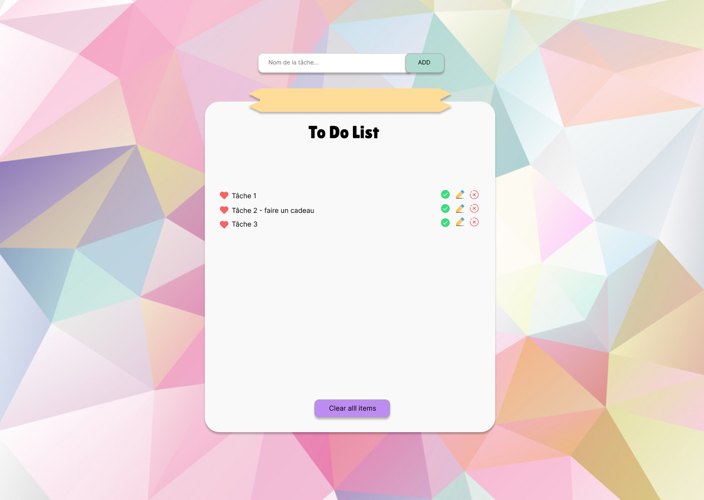

# Réalisation d'un ToDo List  

## Objectifs du projet

L'objectif est de m'entrainer aux languages appris et mettre en place une structuration de code/de projet vu en formation

## Structure du dossier  

- **dossier app :** contient les controllers et les views (templates),
- **dossier public :**contient le css, index.php et JS à terme
- dossier docs : contient la doc nécessaires au projet comme la maquette et également les fichiers html (qui par la suite sont devenus les fichiers .php présent dans le doosier app et public)

## Languages utilisés

- PHP (pour commencer)
- JS (par la suite si besoin)
- HTML
- CSS

## Etapes de réalisation

### 1- Instanciation du HTML et CSS

Pour commencer, je vais faire de l'intégration pure en reproduisant de ma maquette réalisée sur Figma :

